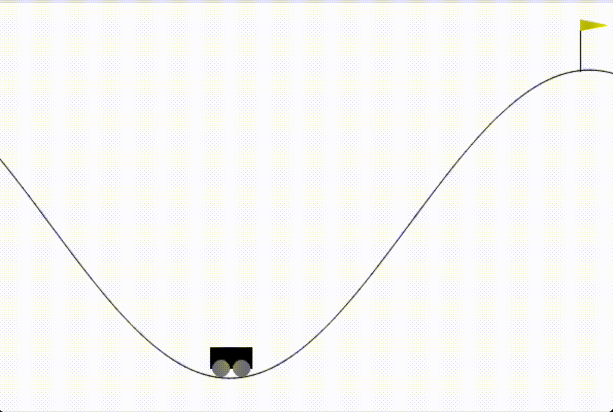

# Reinforcement Learning Mountain Car

Using Q-Learning to train an agent to optimally get a car to a mountain top. Problem environment and simulation available from [Farama](https://gymnasium.farama.org/environments/classic_control/mountain_car/)

The code is broken down with Jupyter and located in the cartpole.ipynb file. To run the code cell by cell, run the cartpole.ipynb file.

To run the code all at once, run the cartpole.py file

### Requirements:

- Jupyter Notebook
- gymnasium
- numpy

### Mountain Car with random policy

### Mountain Car with optimal policy learned with Q-Learning

